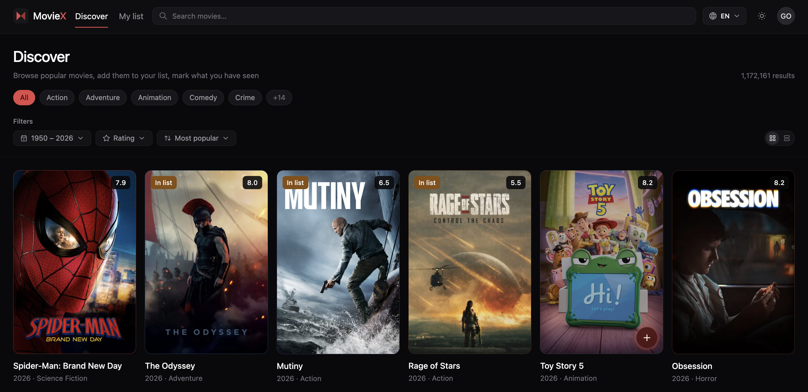
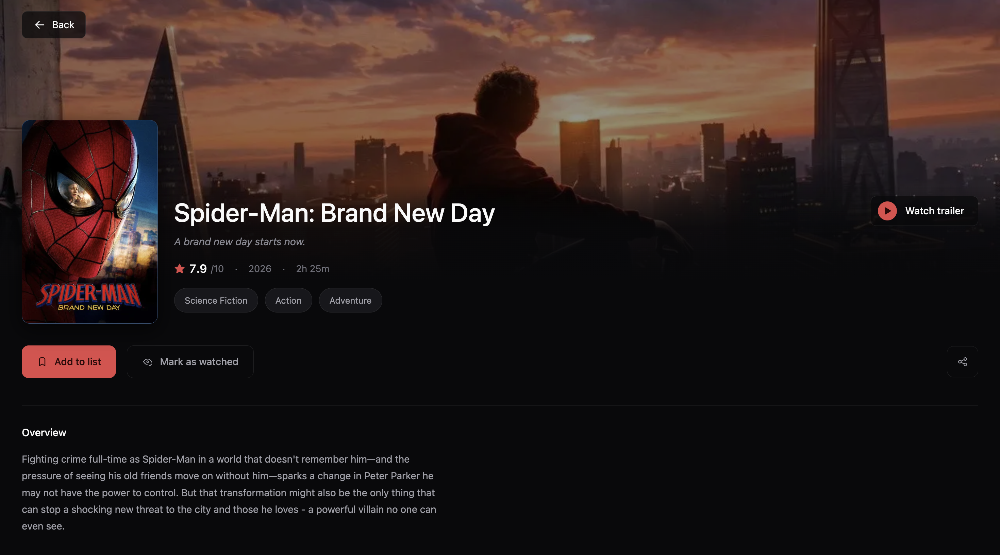
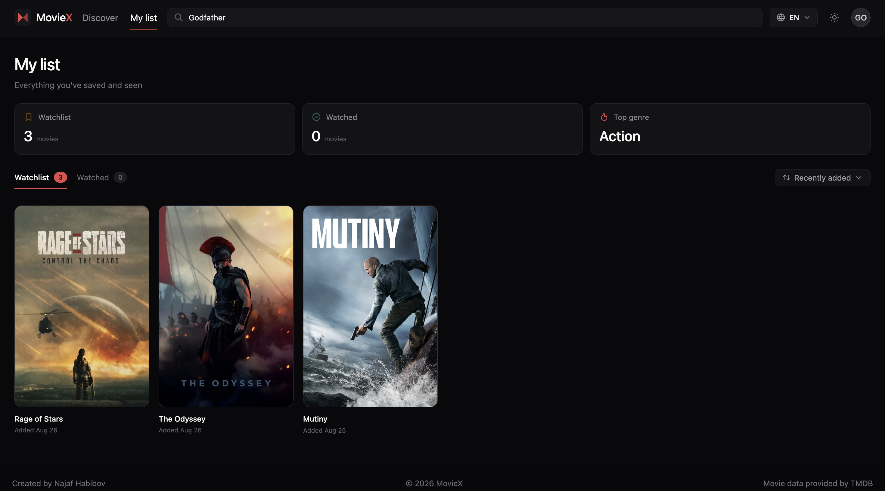
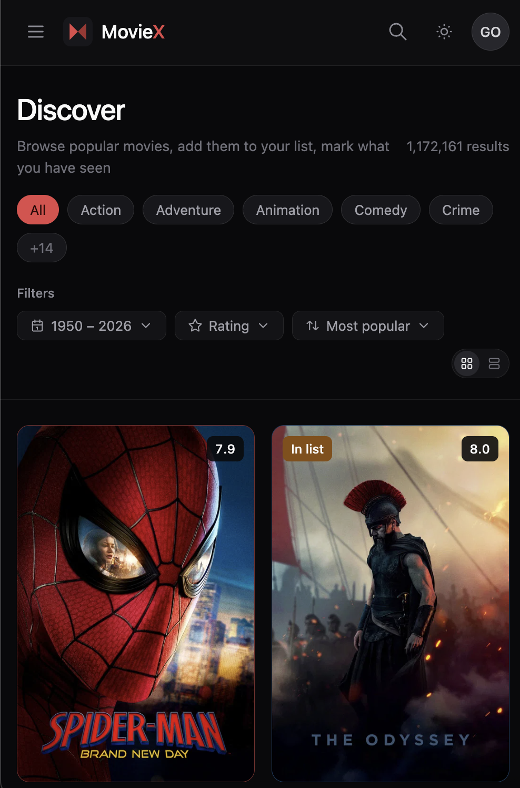

# MovieX

A personal movie discovery and tracking app — browse, search, and keep a
watchlist of what you want to watch and what you've already seen, powered
by [TMDB](https://www.themoviedb.org/).

**Live:** [habiboff.cc/moviex](https://habiboff.cc/moviex)

---

## Screenshots

| Discover | Movie Detail |
|---|---|
|  |  |

| My List | Mobile |
|---|---|
|  |  |

---

## Overview

MovieX is a full-stack movie tracking application built as a personal
portfolio project. It lets users discover movies through TMDB's catalog,
search by title, view detailed information (cast, trailers, ratings), and
maintain a personal list split into **Watchlist** and **Watched** —
deliberately without a ratings/reviews system, keeping the focus on
tracking rather than critique.

## Features

- **Discover** — browse popular/trending movies with filters for genre,
  release year range, minimum rating, and sort order, with numbered
  pagination and a grid/list view toggle
- **Search** — debounced typeahead in the navbar plus a full results page
- **Movie details** — trailer (YouTube embed), cast, director, and
  metadata, pulled from TMDB in a single request
- **My List** — personal Watchlist and Watched tabs with stats (counts,
  top genre) and quick actions (mark watched, remove)
- **Authentication** — email/password accounts with a one-time
  **recovery code** shown at signup (used to reset a forgotten password;
  there is no email-based verification or password reset — the recovery
  code is the only account-recovery path)
- **Internationalization** — full UI in English, Turkish, and Russian,
  with TMDB content (titles, overviews, genres) localized to match
- **Dark theme** throughout, built on a small custom design token system
- **Share** — copy a direct link to any movie

## Tech Stack

**Monorepo:** [Turborepo](https://turbo.build/) with npm workspaces

**Frontend** (`apps/web`)
- [Next.js](https://nextjs.org/) (App Router)
- [Tailwind CSS](https://tailwindcss.com/) v4
- [TanStack Query](https://tanstack.com/query) for data fetching/caching
- [next-intl](https://next-intl-docs.vercel.app/) for i18n (en/tr/ru)
- [shadcn/ui](https://ui.shadcn.com/)

**Backend** (`apps/api`)
- [NestJS](https://nestjs.com/)
- [TypeORM](https://typeorm.io/) + PostgreSQL ([Supabase](https://supabase.com/))
- Hand-rolled JWT auth via httpOnly cookies (no Passport, no refresh
  tokens — session length is controlled by a "Remember me" option instead)
- [`@nestjs/throttler`](https://github.com/nestjs/throttler) for rate
  limiting, [Helmet](https://helmetjs.github.io/) for security headers

**Shared**
- `packages/shared-types` — Zod schemas and TypeScript types shared
  between frontend and backend (types only on the API side, since Node
  can't import raw TypeScript values at runtime)

**Data source:** [TMDB API](https://developer.themoviedb.org/)

**Deployment:** [Vercel](https://vercel.com/) (frontend) +
[Render](https://render.com/) (backend), served together from a single
custom domain via a path-based reverse proxy (`habiboff.cc/moviex/api/*`
→ the Render backend) — this keeps every request same-origin from the
browser's perspective, which matters for cookie-based auth working
reliably across browsers, including Safari's strict cross-site cookie
policies.

## Project Structure

```
moviex/
├── apps/
│   ├── web/               → Next.js frontend
│   └── api/                → NestJS backend
├── packages/
│   └── shared-types/       → Shared Zod schemas & types
├── CLAUDE.md                → Internal engineering notes & conventions
└── turbo.json
```

## Getting Started

### Prerequisites

- Node.js ≥ 18
- npm
- A PostgreSQL database (this project uses [Supabase](https://supabase.com/)'s free tier)
- A [TMDB API key](https://www.themoviedb.org/settings/api) (free)

### Installation

```bash
git clone https://github.com/Habibov97/moviex.git
cd moviex
npm install
```

### Environment variables

Create `apps/api/.env` (see `apps/api/.env.example`):

```dotenv
PORT=3000
NODE_ENV=development
DATABASE_URL=postgresql://...
JWT_SECRET=your-long-random-secret
JWT_EXPIRES_IN=1d
JWT_REMEMBER_EXPIRES_IN=30d
TMDB_API_KEY=your-tmdb-api-key
FRONTEND_URLS=http://localhost:3001
```

Create `apps/web/.env` (see `apps/web/.env.example`):

```dotenv
API_URL=http://localhost:3000
NEXT_PUBLIC_API_URL=http://localhost:3000
```

### Database migrations

```bash
cd apps/api
npm run migration:run
```

### Run locally

From the repo root:

```bash
npm run dev
```

This starts both apps in parallel — frontend at `http://localhost:3001`,
backend at `http://localhost:3000`.

## Design Decisions Worth Knowing

- **No ratings or reviews** — the app is intentionally scoped to
  tracking (watchlist/watched), not critique.
- **Recovery code instead of email verification** — the original design
  used email-based OTP verification, but was replaced after discovering
  that the hosting platform's free tier blocks outbound SMTP traffic at
  the network level. A 6-character recovery code, shown once at signup, is
  used instead — there is no way to recover an account if both the
  password and recovery code are lost, by design.
- **No refresh tokens** — session length is controlled entirely by the
  "Remember me" option at login (short vs. long-lived JWT + matching
  cookie expiry), rather than a refresh-token rotation scheme.

## License

Personal portfolio project. All rights reserved.

## Author

**Najaf Habibov**
[habiboff.cc](https://habiboff.cc)
